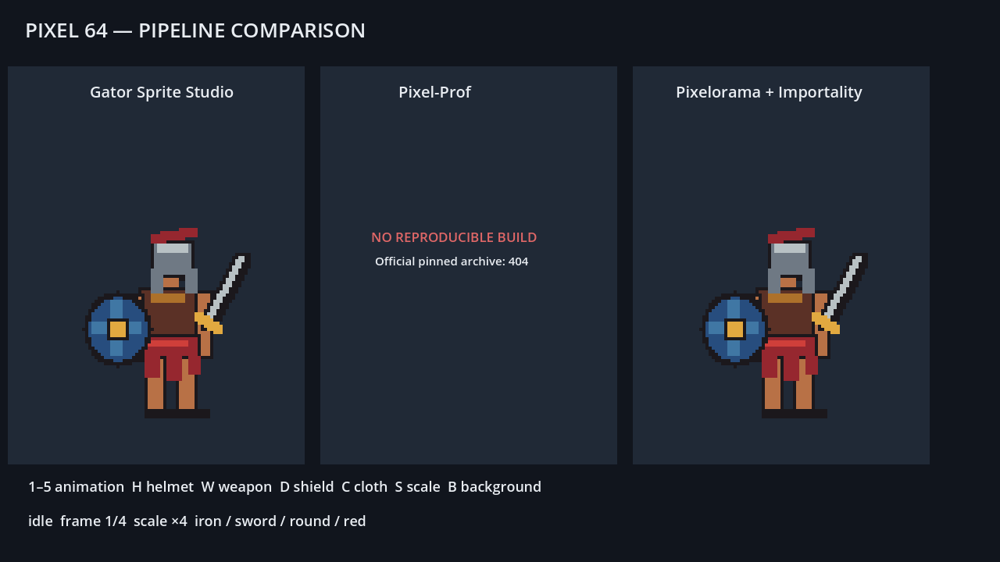

# Evaluación de pipelines Pixel 64

Fecha de la prueba: 2026-07-29

Motor de integración: Godot 4.5.2 stable

Objetivo visual: gladiador adulto de 64×64, 61 píxeles de altura visible, cabeza pequeña, piernas largas, vista lateral en tres cuartos, contorno oscuro y paleta reducida.

## Resultado ejecutivo

La recomendación es **adoptar Gator localmente** para el prototipo Pixel 64. Fue la única opción que completó el ciclo de capas, grupos, tags, pivote, undo/redo, cierre/reapertura, spritesheet y `SpriteFrames` dentro de Godot 4.5.2 sin errores del plugin. Los recursos exportados funcionan sin distribuir el plugin.

**Pixelorama + Importality** queda en segundo lugar. Pixelorama conserva correctamente el documento fuente y sus dos exportaciones fueron idénticas; Importality generó las cinco animaciones y sus duraciones. Sin embargo, Pixelorama 1.1.10 terminó con una violación de acceso después de cada exportación headless en Windows, y activar Importality 0.4.0 en el editor headless de Godot 4.5.2 produjo fugas de objetos/recursos y código de salida 1. No se recomienda convertirlo aún en dependencia permanente.

**Pixels-Prof** no pudo evaluarse de forma reproducible: la descarga fijada publicada por su entrada oficial devuelve HTTP 404. No se sustituyó por una copia no verificable ni por una descarga mutable.

## Versiones, fuentes y licencias

| Herramienta | Versión fijada | Fuente | Licencia observada | Instalación |
|---|---:|---|---|---:|
| Gator Sprite Studio | paquete 1.0.1; `plugin.cfg` interno 1.0.0 | [Godot Asset Store](https://store.godotengine.org/asset/blackwater-gator-studios/gator-sprite-studio/) | [Blackwater Gator Studios License 1.5](https://blackwatergatorstudios.ca/license/), con atribución y restricciones de redistribución | 3.769 s |
| Pixels-Prof | 1.0, commit fijado `8713798e7e0167472036fe82ef66448415dbd27a` | [Godot Asset Library](https://godotengine.org/asset-library/asset/4880) | MIT según la ficha oficial | 0.209 s hasta HTTP 404; no instalado |
| Pixelorama | 1.1.10 | [release oficial](https://github.com/Orama-Interactive/Pixelorama/releases/tag/v1.1.10) | MIT | 29.547 s |
| Importality | 0.4.0; `plugin.cfg` interno 0.3.0 | [release oficial](https://github.com/nklbdev/godot-4-importality/releases/tag/v0.4.0) | MIT | 2.430 s |

Los tiempos de instalación incluyen descarga, extracción y copia local cuando corresponde. Gator e Importality se instalaron bajo `game/addons/` solo para la evaluación y se excluyeron mediante `.git/info/exclude`. Pixelorama se instaló fuera del repositorio. Ningún código de estas herramientas forma parte de los archivos versionados.

## Metodología

Se creó una única silueta de referencia y se mantuvieron las mismas 11 capas en los dos flujos reproducibles:

`Body`, `Cloth_Red`, `Cloth_Blue`, `Hair`, `Helmet_Iron`, `Helmet_Bronze`, `Weapon_Sword`, `Weapon_Spear`, `Shield_Round`, `Shield_Tower` y `Effects`.

Los clips comparten esta distribución:

| Animación | Cuadros | Rango |
|---|---:|---:|
| idle | 4 | 0–3 |
| attack | 5 | 4–8 |
| block | 3 | 9–11 |
| hit | 3 | 12–14 |
| defeat | 5 | 15–19 |

Los tiempos de creación de Gator son mediciones de operaciones deterministas ejecutadas mediante la API local del plugin. Miden la aptitud para automatización con Codex, no el tiempo de dibujo manual de un artista. El documento Pixelorama se construyó como migración estructurada del mismo asset para evitar comparar dibujos distintos; por eso no se atribuyen a Pixelorama tiempos de autoría manual inexistentes.

La escena `PixelPipelineComparison.tscn` utiliza únicamente PNG propios. No carga Gator, Importality ni Pixelorama en ejecución. Las teclas `1`–`5` cambian animación; `H`, `W`, `D` y `C` alternan casco, arma, escudo y faldellín; `S` recorre escalas ×2, ×4 y ×6; `B` cambia entre fondo claro y oscuro.

## Mediciones

| Criterio | Gator | Pixels-Prof | Pixelorama + Importality |
|---|---:|---:|---:|
| Instalación | 3.769 s | 0.209 s hasta 404 | 31.977 s combinados |
| Primer cuerpo | 0.001131 s, automatizado | No medible | No comparable: migración estructurada |
| idle | 0.003190 s, automatizado | No medible | No comparable: migración estructurada |
| attack | 0.005518 s, automatizado | No medible | No comparable: migración estructurada |
| Variante de casco | 0.002922 s, automatizado | No medible | No comparable: migración estructurada |
| Primera exportación | 0.055493 s | No medible | 6.113 s mediante CLI, seguido de crash al salir |
| Segunda exportación | 0.057021 s | No medible | 6.134 s; mismo SHA-256 que la primera |
| Reapertura del fuente | 0.010157 s | No medible | 8.156 s hasta ventana lista y respondiendo |
| Reexportación tras modificar un cuadro | 0.058430 s | No medible | importación directa con Importality: 0.019082 s |

No se asignaron puntuaciones numéricas subjetivas ni se estimaron tiempos faltantes.

## Gator Sprite Studio

Resultados:

- Lienzo real 64×64; caja visible del primer cuadro: 54×61 píxeles.
- 11 capas y cuatro grupos conservados después de guardar, cerrar el proceso y reabrir en un segundo proceso.
- Cinco tags y 20 cuadros conservados.
- Pivote de pies `(0.5, 0.96875)` conservado. El documento mantiene además el slice central inicial creado por la herramienta.
- Paleta indexada y bloqueo de paleta persistentes.
- Onion skin disponible en la herramienta; el documento multicuadro se abrió sin pérdida.
- 20 undo y 20 redo restauraron byte por byte el estado original y el editado. Se ejecutaron 20 undo adicionales para limpiar el documento antes de exportar.
- Dos exportaciones consecutivas produjeron el mismo SHA-256: `69da3bc3bfcb808ffcdc21649a346f9353355dbd7a56c06c7ea1a1acee69c069`.
- La modificación posterior de un cuadro cambió el spritesheet; la reexportación mantuvo capas, tags y clips.
- El `SpriteFrames` exportado contiene exactamente `idle=4`, `attack=5`, `block=3`, `hit=3`, `defeat=5`.
- Con Gator como único plugin artístico activo, `godot45 --headless --editor --path game --quit` terminó con código 0 y sin warnings.

No hubo pérdida de datos. El principal riesgo es de licencia y disponibilidad: el código no puede redistribuirse con el proyecto, por lo que cada colaborador autorizado debe instalarlo localmente. El paquete publicado y el manifiesto interno no coinciden en el número menor de versión; se registran ambos.

## Pixels-Prof

La ficha oficial publica versión 1.0 para Godot 4.5 y licencia MIT. Su URL de descarga fija apunta al commit indicado arriba, pero el servidor devolvió HTTP 404 durante la prueba. El repositorio público enlazado tampoco estaba disponible.

Por esta razón no se midieron estabilidad, capas, onion skin, paletas, undo/redo, reapertura, exportación ni mantenimiento modular. Mostrar un asset copiado de otro flujo en su columna habría dado una impresión falsa de soporte. La escena marca explícitamente esta columna como “NO REPRODUCIBLE BUILD”.

Riesgo de dependencia: **alto**, porque una instalación nueva no puede reconstruirse desde la fuente oficial publicada.

## Pixelorama + Importality

El fuente propio `pixelorama_adult.pxo` usa formato PXO 6 de Pixelorama 1.1.10. Contiene:

- 11 capas con las cuatro parejas de variantes;
- cinco tags con 20 cuadros;
- una paleta de proyecto de ocho colores y una copia GPL;
- datos de origen/pivote de pies;
- imágenes precompuestas y datos RGBA por capa, compatibles con onion skin.

Pixelorama abrió el archivo en una ventana respondiendo con el título esperado. El cierre automatizado abrió el flujo de salida de la aplicación y no terminó dentro de diez segundos, por lo que el proceso se detuvo de forma controlada; no se observó corrupción del `.pxo`.

Dos exportaciones CLI generaron spritesheets visualmente correctos e idénticos (`SHA-256 C7402EB143E78F51FFF778837B4E4FFB9F75D6B91FBC267D03754F05CC388D8A`). En ambos casos, Pixelorama finalizó después de escribir los archivos con `0xC0000005` (`-1073741819`). Los logs mostraron errores de compilador de shader y fugas al apagar su build Godot 4.6.2. Por ello la exportación headless no es fiable como paso de CI en esta máquina.

Importality 0.4.0 leyó el PXO y generó un atlas de 1220×64 y `SpriteFrames` con:

- nombres correctos;
- conteos 4/5/3/3/5;
- duración de 0.125 s por cuadro;
- salida autónoma que carga en Godot sin el addon.

Fue necesario seleccionar un layout de tiras y desactivar la fusión de sprites duplicados para preservar el conteo explícito de cuadros. Con los valores predeterminados, Importality fusiona cuadros visualmente idénticos y suma su duración: la animación se ve igual, pero el conteo deja de coincidir con el fuente.

La actualización automática mediante el importador de editor no se considera aprobada: al activar únicamente Importality junto con el plugin habitual del proyecto, el editor headless importó el PXO pero terminó con `ObjectDB instances leaked`, `121 resources still in use` y código 1. El plugin también priorizó la vista de textura para el PXO hasta seleccionar manualmente el importador `SpriteFrames`. La actualización determinista mediante su API sí reconstruyó el recurso, pero no sustituye la validación del ciclo automático del editor.

Riesgo de dependencia: **medio-alto**. El `.pxo` es abierto y Pixelorama es MIT, pero la automatización depende de un ejecutable externo que falló al salir y de un importador que aún genera fugas en Godot 4.5.2.

## Calidad visual y mantenimiento

Los dos resultados reproducibles son píxel a píxel equivalentes porque usan el mismo diseño base. La silueta cumple 61 píxeles de altura, piernas largas, torso atlético, cabeza relativamente pequeña y lectura clara a ×2, ×4 y ×6. No se observan rasgos chibi.

Las variantes de casco, arma, escudo y faldellín se almacenan en capas separadas y la escena demuestra que pueden sustituirse independientemente. El contorno y la paleta mantienen buena lectura sobre fondos claro y oscuro. El acabado es apropiado para prototipo y prueba de pipeline, no arte comercial final.

Gator ofrece el menor trabajo de integración para Codex porque dibujo, documento, exportación y consumo viven dentro de Godot. Pixelorama tiene mejores garantías de formato abierto y herramientas artísticas maduras, pero añade cambio de aplicación y actualmente necesita tratamiento manual del importador. Pixels-Prof no puede entrar en un flujo mantenible mientras su artefacto fijado no sea recuperable.

## Archivos y aislamiento

Se versionan únicamente:

- PNG propios compuestos y por capa;
- metadatos JSON propios;
- `SpriteFrames` exportados;
- fuente PXO y paleta propios;
- escena y controlador comparativos;
- esta captura y este informe.

Quedan excluidos localmente:

- `game/addons/gator_sprite_studio/`;
- `game/addons/pixel_prof/` y `game/addons/pixels_prof/`;
- `game/addons/nklbdev.importality/`;
- Pixelorama y los archivos descargados;
- arneses locales de evaluación;
- `.import`, `.godot`, logs y configuración local.

`project.godot` quedó restaurado con solo el plugin habitual del proyecto; ninguna escena productiva, autoload, sistema de combate, guardado ni JSON de producción fue modificado.

## Decisión de fusión

Conviene fusionar la evidencia y la escena de comparación porque son autónomas. No conviene fusionar todavía Gator, Pixelorama ni Importality como dependencias del proyecto. El siguiente paso recomendado es una prueba de producción acotada con Gator local: un segundo personaje adulto y una iteración real por un artista. Si esa prueba confirma el ahorro fuera del arnés automatizado, se puede formalizar un procedimiento de instalación privado y atribución sin distribuir el addon.
